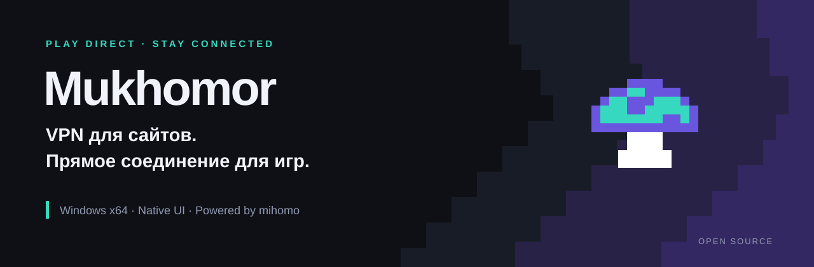
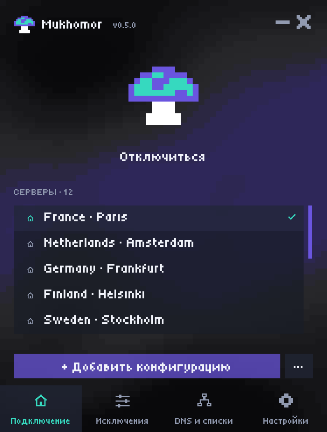
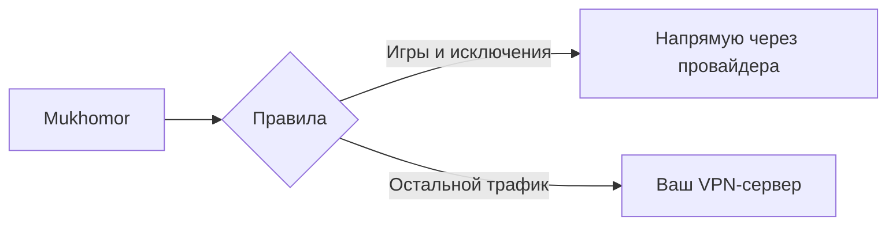

  

  
  
  
  
  

  <a href="https://github.com/0nionow1/Mukhomor/releases/latest"><b>Скачать для Windows</b></a> ·
  <a href="docs/README.md">Документация</a> ·
  <a href="docs/vps-and-vpn.md">Свой VPS и VPN</a> ·
  <a href="CHANGELOG.md">Что нового</a> ·
  <a href="README.en.md">English</a>

# Mukhomor · Мухомор

**VPN для нужных сервисов. Прямое соединение для игр.**

Mukhomor — открытый клиент для Windows для российских игроков, которым нужен VPN, но мешает лишний маршрут до игрового сервера. Добавьте свой VPN-профиль, а игры и выбранные сайты отправляйте напрямую.

В основе — [mihomo от MetaCubeX](https://github.com/MetaCubeX/mihomo/tree/v1.19.32). Mukhomor добавляет нативный интерфейс, локальный импорт серверов, готовые игровые исключения и управление установкой, подключением и восстановлением DNS. Сетевые протоколы реализует mihomo; это независимый проект.

## Что умеет

| Возможность | Для чего |
| --- | --- |
| Исключения по `.exe`, доменам, зонам и IP/CIDR | Игра — напрямую, остальной трафик — через VPN |
| Готовые правила | Игровые процессы, qBittorrent, российские сервисы и Steam |
| 21 тип серверных узлов | WireGuard/AmneziaWG, VLESS, VMess, Trojan, Shadowsocks, Hysteria 2 и [другие](docs/protocols.md) |
| Локальный импорт | Файл, ссылка, список ссылок, ограниченные JSON/YAML и inline OpenVPN |
| Нативный Rust/Win32 интерфейс | Пиксельный гриб, трей, Русский/English; без WebView |
| Подключение и восстановление | Отмена запуска, восстановление DNS, автоподключение, обновление с сохранением профилей |

Прямые исключения работают для TCP и UDP. Они убирают VPN из игрового маршрута, но не гарантируют пинг ниже вашего обычного соединения: результат зависит от провайдера и игрового сервера.

## Запуск за несколько минут

1. Скачайте **`Mukhomor-X.Y.Z-windows-x64.zip`** из [последнего релиза](https://github.com/0nionow1/Mukhomor/releases/latest).
2. Распакуйте **весь архив** и запустите **`Mukhomor/mukhomor.exe`**. Подтвердите запрос Windows при первой установке.
3. Нажмите **Добавить конфигурацию** и выберите свой файл или вставьте серверную ссылку/текст.
4. Выберите сервер и нажмите **Подключиться**. При необходимости добавьте `.exe` игры в **Исключения** и сохраните.

Нужны Windows 10/11 **x64** и собственный серверный профиль. Серверы, ключи и подписки не входят в комплект. EXE пока без подписи издателя; в Releases есть SHA256 для проверки архивов. Полное руководство: [установка, трей, обновление и удаление](docs/getting-started.md).

Крестик скрывает окно в трей и сохраняет VPN. **Выход из Mukhomor** в трее отключает VPN и восстанавливает DNS. Для обновления распакуйте новую версию целиком и запустите её EXE; профили сохраняются.

## Как разделяется трафик

По умолчанию напрямую идут заданные игровые процессы, qBittorrent, включённые списки России и Steam, зоны `.ru`/`.рф`. Правила можно изменить. Прямой трафик использует обычный внешний IP вашего провайдера. [Примеры и приоритеты исключений](docs/gaming-and-routing.md).

## Протоколы и собственный сервер

Импортируются WireGuard/AmneziaWG, VLESS, VMess, Trojan, Shadowsocks/SSR, Hysteria 1/2, TUIC, Snell, SOCKS5, HTTP/HTTPS, SSH, AnyTLS, Mieru, TrustTunnel, ShadowQUIC, GOST Relay, Sudoku, MASQUE и OpenVPN.

Форматы имеют ограничения: принимаются отдельные узлы, а не произвольный полный Clash-конфиг; URL подписки не скачивается автоматически. Поддержка UDP зависит от протокола и сервера. [Матрица форматов и примеры](docs/protocols.md).

Нет сервера? В [руководстве по VPS и VPN](docs/vps-and-vpn.md) собраны пути через AmneziaWG, WireGuard, Xray/VLESS/Reality, Hysteria 2 и официальные источники остальных протоколов.

## Документация и участие

| Для пользователя | Для разработчика |
| --- | --- |
| [Первый запуск и обновление](docs/getting-started.md) | [Сборка и тесты](docs/development.md) |
| [Игры и исключения](docs/gaming-and-routing.md) | [Архитектура](docs/architecture.md) |
| [Протоколы и импорт](docs/protocols.md) | [Выпуск версий](docs/releasing.md) |
| [Свой VPS и VPN](docs/vps-and-vpn.md) | [Как внести изменение](CONTRIBUTING.md) |
| [Решение проблем](docs/troubleshooting.md) | [Безопасность](SECURITY.md) |

Ошибки и предложения: [Issues](https://github.com/0nionow1/Mukhomor/issues). Не прикладывайте рабочие VPN-профили, ключи или ссылки подписок.

## Основа и благодарности

Спасибо авторам [mihomo](https://github.com/MetaCubeX/mihomo), [Wintun](https://www.wintun.net/), [meta-rules-dat](https://github.com/MetaCubeX/meta-rules-dat) и [Tiny5](https://github.com/google/fonts/tree/main/ofl/tiny5).

Собственный код Mukhomor — [MIT](LICENSE). Закреплённый mihomo v1.19.32 — [GPL-3.0](Mihomo-LICENSE.txt); соответствующий исходный архив входит в пакеты релиза. Wintun, списки, шрифт и Rust-зависимости сохраняют свои лицензии. [Полная атрибуция, версии и источники](docs/credits.md).
