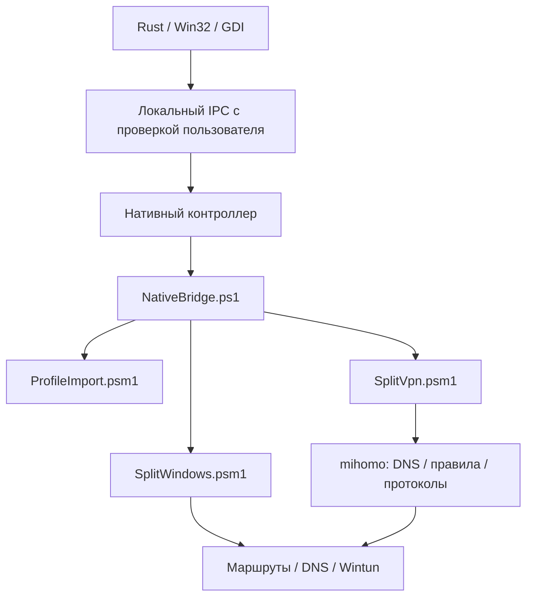

# Архитектура

Приложение сохраняет небольшое разделение: нативный интерфейс, контроллер жизненного цикла, операции Windows и отдельное сетевое ядро. Браузерного движка, WebView и постоянно работающего Node.js нет.

| Место | Ответственность |
| --- | --- |
| `native/src/ui.rs`, `i18n.rs` | Окно, формы, трей и языки |
| `native/src/backend.rs`, `service.rs`, `platform.rs` | IPC, владение процессами, состояние, отмена и дедлайны |
| `native/src/setup.rs`, `Install.ps1`, `Uninstall.ps1` | Установка, обновление, права и удаление |
| `NativeBridge.ps1` | Выполнение ограниченной операции и ответ JSON |
| `ProfileImport.psm1` | Ограниченный локальный парсер и нормализация узлов |
| `SplitVpn.psm1` | Валидация настроек, генерация конфига и обращения к API ядра |
| `SplitWindows.psm1` | Выбор физического транспорта, контроль маршрутов, DNS и восстановление |
| `native/build.rs`, `font.rs`, `texture.rs` | Встроенные ресурсы, палитра, шрифт и буферная отрисовка |

## Жизненный цикл и импорт

Интерфейс и контроллер ждут событий. PowerShell работает на время операции. Запуск, отмена, отключение и выход синхронизируются; новая отмена/выход имеют приоритет над устаревшей операцией. Ответ bridge заканчивается переводом строки: нельзя ждать EOF stdout, если ядро остаётся дочерним процессом. Подробности и регрессии: [native/README.md](https://github.com/0nionow1/Mukhomor/blob/main/native/README.md).

Импорт не управляет глобальными настройками ядра и не выполняет скрипты профиля. Сначала проверяются весь ввод и кандидат конфигурации через закреплённый mihomo, затем обновляется библиотека. Профили и API-токен хранятся как приватные локальные данные. Выбранный сервер имеет исторический внутренний псевдоним `AWG` для всех протоколов; это не ограничение только WireGuard.

## Правила и производительность

Большие списки от 32 пользовательских доменов или IP/CIDR компилируются в нативные наборы mihomo. Приоритеты и точное/суффиксное совпадение сохраняются; наборы входят в валидируемый кандидат и откатываются вместе с ним. Поиск процессов отключён, когда EXE-исключений нет. Порядок правил описан в [руководстве для пользователей](gaming-and-routing.md).

Палитра в `assets/theme.json` компилируется в EXE. Фон и пиксельный гриб создаются при сборке; приложение копирует видимый участок из кэшированных GDI поверхностей. Анимация подключения ограничена видимым окном. Настройка цветов предназначена для сборки, а не для работающего клиента.

## Изоляция и публикация

У Mukhomor собственные IPC, TUN-адаптер, порты и правила Windows. Настройки других VPN не импортируются автоматически. Перед подключением выполняется проверка другого VPN. Установка и DNS действительно затрагивают Windows; большинство тестов подменяют эти операции или используют loopback.

Git публикует только разрешённые исходники. Релиз собирается по явным спискам файлов, с проверкой SHA256 зависимостей и манифестом каждого пакета. Приватные конфиги не являются входом сборки. Новую документацию и тесты нужно включать в список упаковки; [инструкция выпуска](releasing.md) описывает проверку.
