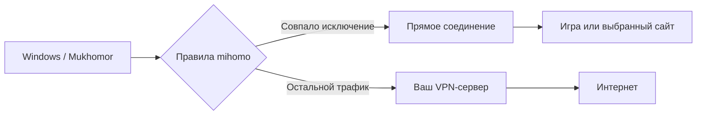

# Игры и исключения

## Зачем это нужно

Если игра идёт через удалённый VPN-сервер, меняется её сетевой маршрут. Mukhomor позволяет отправить её напрямую, а браузер и остальной трафик оставить в VPN. Это убирает VPN из игрового пути; результат зависит от провайдера, игрового сервера и маршрута. Приложение не обещает уменьшить пинг ниже обычного прямого соединения.

Трафик исключений выходит через вашего провайдера и показывает обычный внешний IP. Исключения — сознательный выбор маршрута. Публичные списки и `.ru`/`.рф` включены по умолчанию; это приложение не предназначено для режима «абсолютно всё только через VPN».

## Что настроено заранее

В [публичных настройках](../assets/settings.default.json) заданы имена процессов CS2, Dota 2, Deadlock, PUBG, Valorant, Apex Legends, Fortnite, Escape from Tarkov, League of Legends, Overwatch, Rainbow Six, Rocket League, Rust, Hunt, Call of Duty и qBittorrent. Правила имён действуют на TCP и UDP.

Включены доменные списки **Россия** и **Steam**, зоны `.ru` и `.рф`. Список **Ozon** доступен, но выключен. Домены берутся из [meta-rules-dat](https://github.com/MetaCubeX/meta-rules-dat); они могут меняться. Исключение Steam затрагивает совпавшие домены сервиса, а не только игровые матчи.

## Добавить игру

1. Откройте **Исключения**.
2. Добавьте имя процесса, например `my-game.exe`, или выберите полный путь к `.exe`.
3. Нажмите **Сохранить**.
4. Перезапустите игру или переподключите её к серверу: уже открытые соединения могут сохранять прежний маршрут.

Имя лаунчера не обязательно совпадает с процессом игры. Проверьте вкладку **Подробности** Диспетчера задач. Правило по имени применяется к любому процессу с таким именем; полный путь точнее.

## Домены и IP

Каждая строка — отдельное правило.

| Список в интерфейсе | Пример | Действие |
| --- | --- | --- |
| Точные домены | `example.com` | Только этот домен |
| Домены с поддоменами / зоны | `example.com` | Домен и его поддомены |
| Зоны | `ru`, `рф` | Вся соответствующая зона |
| IP и CIDR | `192.0.2.10`, `2001:db8::/32` | Соответствующие адреса; здесь приведены учебные адреса |
| Исключения из готовых списков | `example.com` | Возвращает домен и поддомены в VPN, если их направлял напрямую готовый список |

Для игровых процессов удобнее `.exe`: адреса серверов могут меняться. IP-правило для общего CDN может затронуть несколько сервисов; по возможности используйте домен.

## Приоритеты

Первое совпавшее правило определяет маршрут:

1. Адрес самого VPN-сервера идёт напрямую, чтобы соединение не завернулось в собственный туннель.
2. Ваши исключения процессов.
3. Ваши точные домены и суффиксы/зоны.
4. Домены, возвращённые в VPN из публичных списков.
5. Включённые публичные списки.
6. Локальные сети, затем ваши IP/CIDR.
7. Известный прочий домен идёт в VPN; необязательный DNS-IP резерв применяется к соединениям без известного домена.
8. Остальной трафик — выбранный VPN-профиль.

Поэтому «вернуть в VPN из готового списка» не отменяет более раннее исключение процесса или вашу зону `ru`. Уберите соответствующее более раннее правило, если хотите такой домен направить в VPN.

## qBittorrent и голосовая связь

Для qBittorrent используется обычный сетевой интерфейс. Если в самом qBittorrent задан только VPN-адаптер, эта привязка может мешать прямому маршруту. Проверьте **Настройки qBittorrent → Дополнительно → Сетевой интерфейс**.

Mukhomor не отправляет весь UDP напрямую. Звонки и другие программы используют VPN, если для них нет исключения и выбранный протокол поддерживает их транспорт.

## DNS и списки

Публичные начальные списки поставляются с архивом; включённые списки обновляются ядром с интервалом 6 часов. На вкладке **DNS и списки** можно включить дополнительное получение A/AAAA через Cloudflare и Google DNS JSON API. По умолчанию оно выключено.

Эта опция учитывает TTL, CNAME, ограничения количества адресов и сохраняет последний успешный ответ на ограниченное время. Наблюдение добавляет реально встреченные поддомены, а не перечисляет все поддомены сайта. Резервные IP не превращают известные чужие домены на общем CDN в прямые исключения.
